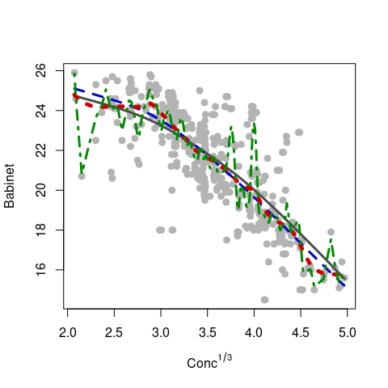

Robust nonparametric regression
================
2023-05-01

This is a companion repository for the paper “Robust nonparametric
regression: review and practical considerations” (In Press) Econometrics
and Statistics, DOI: <https://doi.org/10.1016/j.ecosta.2023.04.004>.

The file `robust-non-param-example-public.R` contains an `R` script
reproducing the illustration example in that paper. Below is an
`R markdown` version of the same script.

### Data

We use the `polarization` data from the package `ggcleveland`. The
response variable is the scattering angle where polarization disappears
(`babinet`), and the explanatory variable is the cubic root of the
particulate concentration of a gas in the atmosphere (`concentration`).
To avoid numerical issues with repeated values, this variable is
perturbed by adding a small amount of random uniformly distributed noise
(via `jitter`):

``` r
data(polarization, package='ggcleveland')
pol <- polarization
set.seed(123)
pol$conc3 <- jitter( pol$concentration^(1/3), factor = 10 )
plot(babinet ~ conc3, data = pol, pch=19, col='gray70', cex=1.1)
```

<!-- -->

### Classical smoothing splines estimator

The classical smoothing spline estimator, computed with penalization
selected via GCV, as described in Wood, S.N., (2006), Generalized
Additive Models, Boca Raton: Chapman & Hall / CRC.

``` r
library(mgcv)
a <-gam(babinet ~ s(conc3), data=pol) 
```

### M-smoothing splines estimators

M-smoothing splines as proposed in Kalogridis, I. and Van Aelst, S.,
(2021), M-type penalized splines with auxiliary scale estimation,
Journal of Statistical Planning and Inference, 212, 97-113. The code is
publicly available at
<https://github.com/ioanniskalogridis/Smoothing-splines>.

``` r
source('https://raw.githubusercontent.com/ioanniskalogridis/Smoothing-splines/main/Huber')
y <- pol$babinet[order(pol$conc3)]
x <- sort(pol$conc3)
fit.huber1 <- huber.smsp(x = x, y = y, k  = 1.345, interval = c(1e-16, 1)) 
```

M-smoothing splines as proposed in Oh, H-S., Nychka, D.W., Brown, T. and
Charbonneau, P., (2004), Period analysis of variable stars by robust
smoothing, Journal of the Royal Statistical Society, Series C, 53,
15-30. Code is available from the `R` package
[fields](https://cran.r-project.org/package=fields). The first fit was
obtained by selecting the smoothing parameter as recommended by the
authors. The second one was obtained with a post-hoc subjective
selection as hinted in the help page of the function `fields::qsreg`.

``` r
# Oh et al (robust smoothing)
library(fields)
oh1 <- qsreg(x=x, y=y, maxit.cv=100) 
pr <- predict(oh1, x)
si <- mad( y - pr )
oh2.0 <- qsreg(x=x, y=y, sc = si, maxit.cv = 100) 
lam<- oh2.0$cv.grid[,1]
tr<- oh2.0$cv.grid[,2]
lambda.good<- max(lam[tr>=15])
oh2 <- qsreg(x=x, y=y, sc = si, lam = lambda.good) 
```

### M-local kernel estimator

The M-local linear estimator as proposed in Boente, G., Martínez, A. and
Salibian-Barrera, M., (2017), Robust estimators for additive models
using backfitting, Journal of Nonparametric Statistics, 29(4), 744-767.
Code is available in the `R` package
[RBF](https://cran.r-project.org/package=RBF). We use a robust
leave-one-out cross-validation criterion to select an optimal bandwidth.
This loop can take a relatively long time to complete, so we do not run
it here and use the optimal value (`0.2111111`).

``` r
library(RBF)
y <- pol$babinet[order(pol$conc3)]
x <- sort(pol$conc3)
n <- length(y)
# nh <- 10
# hh <- seq(.1, .3, length=nh) # previous search over (.05, 1), narrowed here
# cvbest <- +Inf
# rmspe <- rep(NA, nh)
# for(i in 1:nh) {
#   # leave-one-out CV loop
#   preds <- rep(NA, n)
#   for(j in 1:n) {
#     tmp <- try( backf.rob(y ~ x, point = x[j],
#                           windows = hh[i], epsilon = 1e-6,
#                           degree = 1, type = 'Tukey', subset = c(-j) ))
#     if (class(tmp)[1] != "try-error") {
#       preds[j] <- rowSums(tmp$prediction) + tmp$alpha
#     }
#   }
#   pred.res <- preds - y
#   tmp.re <- RobStatTM::locScaleM(pred.res, na.rm=TRUE)
#   rmspe[i] <- tmp.re$mu^2 + tmp.re$disper^2
#   if( rmspe[i] < cvbest ) {
#     jbest <- i
#     cvbest <- rmspe[i]
#     # print('Record')
#   }
#   # print(c(i, rmspe[i]))
# }
# bandw <- hh[jbest]
bandw <- 0.2111111
tmp <- backf.rob(y ~ x, windows=bandw, degree=1, type='Tukey', point=x)
```

### S-penalized splines estimator

Robust penalized splines (based on S-estimators) as proposed in
Tharmaratnam, K., Claeskens, G., Croux, C. and Salibian-Barrera, M.,
(2010), S-estimation for penalized regression splines, Journal of
Computational and Graphical Statistics, 19(3), 609-625. The code is
available at <https://github.com/msalibian/PenalizedS>.

``` r
source("https://raw.githubusercontent.com/msalibian/PenalizedS/master/pen-s-functions.R")
lambdas <- seq(1e-4, 10, length = 100) 
p <- 3
y <- pol$babinet[order(pol$conc3)]
x <- sort(pol$conc3)
n <- length(x)
num.knots <- max(5, min(floor(length(unique(x))/4), 35))
knots <- quantile(unique(x), seq(0, 1, length = num.knots + 2))[-c(1, (num.knots + 2))]
xpoly <- rep(1, n)
for (j in 1:p) xpoly <- cbind(xpoly, x^j)
xspline <- outer(x, knots, "-")
xspline <- pmax(xspline, 0)^p
X <- cbind(xpoly, xspline)
# penalty matrix
D <- diag(c(rep(0, ncol(xpoly)), rep(1, ncol(xspline))))

NN <- 500  # max. no. of iterations for S-estimator
# NNN no. of initial candidates for the S-estimator
cc <- 1.54764
b <- 0.5
tmp.s <- pen.s.rgcv(y = y, X = X, D = D, lambdas = lambdas, num.knots = num.knots, 
                    p = p, NN = NN, cc = cc, b = b, NNN = 50)
```

### Visual comparison of the different estimators

The plots below compare the different robust fits computed above. Given
the number of different fits considered, we separate these regression
estimates into two groups: smoothing splines and others (penalized
splines and local kernel estimators).

#### Smoothing splines estimators

``` r
plot(babinet ~ conc3, data = pol, pch=19, col='gray70', cex=1.1, 
     xlab=expression(Conc^{1/3}), ylab='Babinet')
lines(pol$conc3, fitted(a), type='l', lwd=3, col='gray30')
lines(x, fit.huber1$fitted, lwd=3, lty=2, col='blue3')
lines(x, predict(oh2, x), lwd=5, lty=3, col='red3')
lines(x, predict(oh2.0, x), lwd=3, lty=4, col='green4')
```

<!-- -->

In the figure above the grey solid line is the classical fit, the blue
dashed line is the M-smoothing spline (Kalogridis and Van Aelst, 2021),
the robust-GCV-based M-smoothing spline (Oh et al, 2004) is the green
dash-dot line, while the red dotted line corresponds to the fit obtained
with a subjectively chosen value of the smoothing parameter.

#### Penalized splines and local kernel estimators

``` r
plot(babinet ~ conc3, data = pol, pch=19, col='gray70', cex=1.1, 
     xlab=expression(Conc^{1/3}), ylab='Babinet')
lines(x, tmp.s$yhat, lwd=3, lty=1, col='red3')
lines(x, as.numeric(tmp$prediction + tmp$alpha), lwd=3, lty=2, col='blue3')
```

<!-- -->

In the figure above the red solid line is the S-penalized splines fit
while the blue dashed line is the robust local linear M-estimator.
